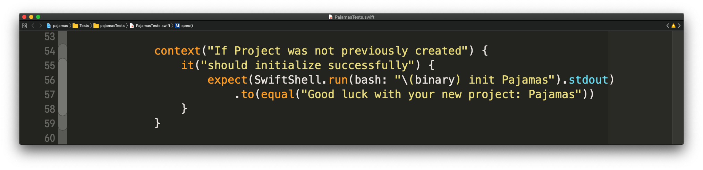
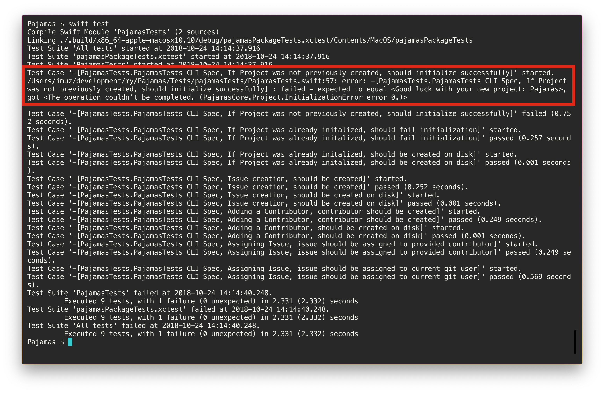
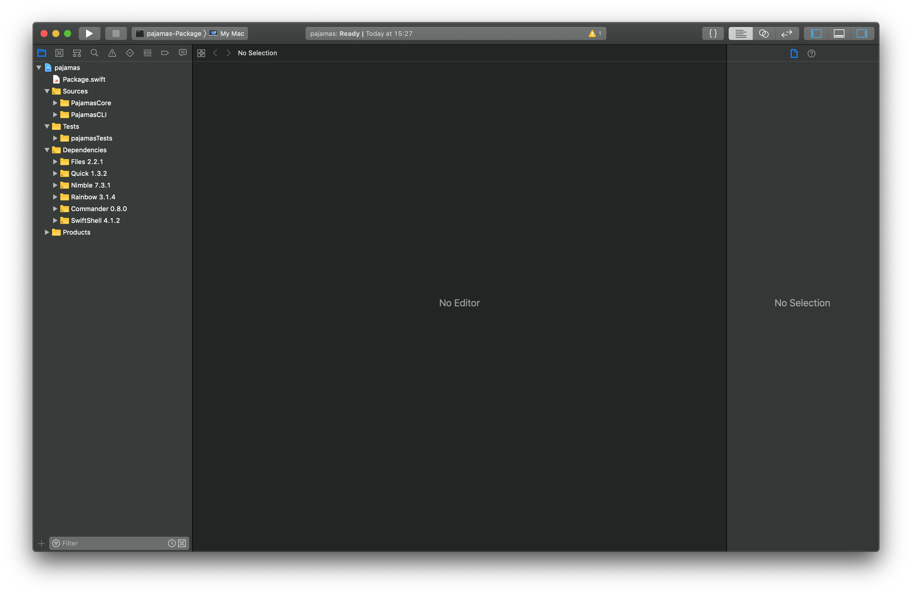

# BDD approach for CLI application development in Swift

[TOC]

## Behavior Driven Development in Swift

### What is BDD?

In software engineering, **behavior-driven development (BDD)** is a software development process that emerged from **test-driven development (TDD).**

#### Then what is TDD?

**Test-driven development** is a software development process that relies on the **repetition of** a very **short** development **cycle**: **requirements** are **turned** into very **specific test cases**, then the **software is improved** to **pass** the **new tests, only**. 

#### And back to BDD 

**Behavior-driven development** **combines** the general **techniques** and **principles** of **TDD** with **ideas** from **domain-driven design** and **object-oriented analysis** and **design** to provide software development and management teams with **shared tools** and a **shared process** to **collaborate on** software **development**.

So, speaking in human terms developers get to work closer with management by first writing test cases to the specification provided by management which are more about interaction with the app and how it should happen and then make code satisfy this new test cases.

#### Why bother?

##### If it's not tested it's not working

While BDD is more about management than development if we as developers can accept that writing tests is a must, cause if it's not tested it's not working. If we owe to make some quality code it must be tested. 

Yet even better if we do development TDD style why not go one step further and try BDD approach. 

##### Story vs. Specification

The big difference between TDD and BDD is that while applying BDD you write test to the specification and test describes behavior rather than unit of implementation, so it's simpler to comprehend for humans. 

### How to approach it?

#### Workflow

Test-driven development is a software development methodology which essentially states that for each unit of software, a software developer must:

- define a test set for the unit *first*.
- make the tests fail.
- then implement the unit.
- finally verify that the implementation of the unit makes the tests succeed.

This definition is rather non-specific in that it allows tests in terms of high-level software requirements, low-level technical details or anything in between. One way of looking at BDD therefore, is that it is a continued development of TDD which makes more specific choices than TDD.

Behavior-driven development specifies that tests of any unit of software should be specified in terms of the desired behavior of the unit.

Borrowing from agile software development the "desired behavior" in this case consists of the requirements set by the business — that is, the desired behavior that has business value for whatever entity commissioned the software unit under construction.

#### Quick & Nimble

There is more than one framework but for no particular reason i settled on **Quick** which is accompanied by **Nimble**. So i'm much obliged to at least introduce them.

##### Quick

> Quick is a behavior-driven development framework for Swift and Objective-C. Inspired by [RSpec](https://github.com/rspec/rspec), [Specta](https://github.com/specta/specta), and [Ginkgo](https://github.com/onsi/ginkgo).

Quick is the one thing that will actually run your tests and which allows you to define specifications.

##### Nimble

> Use Nimble to express the expected outcomes of Swift or Objective-C expressions. Inspired by [Cedar](https://github.com/pivotal/cedar).

Nimble is a matcher framework for Quick which provides you with an awesome DSL for setting your expectations from low to high.

#### Specification DSL

Today most of testing frameworks utilize some kind of DSL to express tests. 

DSL is a computer langauge specialized to a particular application domain. 

When you write your tests to match specification which are mostly plain english you get benefit of your test cases looking almost exactly the same as specification to which they are done. 

Or even better if you are developing software as a sole proprietor tests can literally describe user interaction with an app and all specifications you need is your tests.




```swift
context("If Project was not previously created") {
    it("should initialize successfully") {
        expect(SwiftShell.run(bash: "\(binary) init Pajamas").stdout)
            .to(equal("Good luck with your new project: Pajamas"))
    }
}
```


And if test framework logs everything in a right way, log provides understanding of what's broken for even non technical humans on the project.




## Swift Package Manager

### What is SPM?

The Swift Package Manager is a tool for managing distribution of source code, aimed at making it easy to share your code and reuse others’ code. The tool directly addresses the challenges of compiling and linking Swift packages, managing dependencies, versioning, and supporting flexible distribution and collaboration models.

Apple designed the system to make it easy to share packages on services like GitHub, but packages are also great for private personal development, sharing code within a team, or at any other granularity.

Note that at this time the Package Manager has no support for iOS, watchOS, or tvOS platforms.

The Package Manager is included in Swift 3.0 and above.

### Pros

- Generating Xcode project on the fly, no more conflicts in Xcode project ever.
- Manage your dependencies by editing a single file which is Package.swift.
- Build, run and test on linux and macOS and even in Xcode.
- File structure is a single point of trust, rearrange your files and just generate Xcode project and it all synced up.
- You can use system C libraries on linux/bsd/macOS from Swift by just defining a package for them in a right way.
- Edit mode for your dependencies.
- Define Targets, Products and their Dependencies in Package.swift.

### Cons

- Currently does not support building for iOS, watchOS or tvOS (this one is pretty much enough to discourage anyone not interested in Swift on the backend from using SPM).
- Commands to use SPM is a bit verbose unlike the new iPhone names.


## Developing Command Line Interface application in Swift

### One last what is: What is CLI?

Command line interface (CLI) is a text-based interface that is used to operate software and operating systems while allowing the user to respond to visual prompts by typing single commands into the interface and receiving a reply in the same way.

CLI is quite different from the graphical user interface (GUI) that is presently being used in the latest operating systems.

### And how about we build one right now using all of the things i mentioned before

Step one: Create manifest file called **Package.swift** with the help of **SPM**.

```bash
swift package init --type executable
```

Now we'll need to edit our manifest file to look something ~~more~~ exactly like this:

```swift
// swift-tools-version:4.2
// The swift-tools-version declares the minimum version of Swift required to build this package.

import PackageDescription

let package = Package(
    name: "pajamas",
	products: [
		.executable(name: "pajamas", targets: ["PajamasCLI"]),
		.library(name: "pajamas-core", targets: ["PajamasCore"])
	],
    dependencies: [
		.package(url: "https://github.com/kareman/SwiftShell", from: "4.0.0"),
		.package(url: "https://github.com/kylef/Commander", from: "0.8.0"),
		.package(url: "https://github.com/onevcat/Rainbow", from: "3.0.0"),
		.package(url: "https://github.com/Quick/Quick", from: "1.3.2"),
		.package(url: "https://github.com/Quick/Nimble", from: "7.3.1"),
		.package(url: "https://github.com/JohnSundell/Files", from: "2.2.1"),
    ],
    targets: [
		.target(
			name: "PajamasCore",
			dependencies: [
                "Files",
            ],
			path: "Sources/Core"
		),
        .target(
            name: "PajamasCLI",
            dependencies: [
				"PajamasCore",
				"Commander",
				"Rainbow",
				"SwiftShell",
			],
			path: "Sources/CLI"
		),
        .testTarget(
            name: "PajamasTests",
            dependencies: [
				"PajamasCLI",
				"Quick",
				"Nimble",
				"SwiftShell",
                "Files",
			],
			path: "Tests"
		),
    ]
)

```

Notice that we define our **Products**, **Dependencies** and **Targets** as a building blocks for our application.

Products define results of your build while they must define targets from which to build them. 

Target of the executable product must have a **main.swift** file to actually be compiled into executable. 

Package **Dependencies** define dependencies of our project while each **target** defines it's own dependencies and can depend on other targets. 

Also each target must specify a path where all the sources are located.

//Separate  When dealing with **SPM** filesystem is a kind. (we'll see it later in step when we gonna make xcode project)

Also we have a separate **target for tests**, and we don't need any products for it.

Now in order to setup this project and start working on it we'll need to execute few more commands through terminal:

```bash
mkdir Pajamas
cd Pajamas

swift package resolve # will resolve and install dependencies

mkdir -p Sources/Core
mkdir -p Sources/CLI # we create main diretories for sources of our targets

touch Sources/CLI/main.swift 
touch Sources/Core/main.swift # we create empty files so that we can generate xcode project from something

swift package generate-xcodeproj # we generate xcode project

open -a Xcode . # and now we continue working with our project from Xcode
```

Now you should see the following.



Since i wanted to approach this BDD way lets write some tests right away.

Open the pajamasTests.swift and update to look like this:

```swift
import XCTest
import Quick
import Nimble
import SwiftShell
import Files

@testable import PajamasCore

class PajamasTests: QuickSpec {

	private var path: String { return SwiftShell.main.currentdirectory }
    
    private var binaryName: String {
        #if os(macOS)
            if path.contains("DerivedData") {
                return "PajamasCLI"
            } else {
                return "pajamas"
            }
        #else
            return "pajamas-linux"
        #endif
    }
    
    override func spec() {
        let binary = path + "/" + binaryName
        let temp = try! Folder.temporary.createSubfolderIfNeeded(withName: "pajamas.test")
        
        func setup() {
            cleanup()
            try! Folder.temporary.createSubfolderIfNeeded(withName: "pajamas.test")
			SwiftShell.main.currentdirectory = temp.path
        }
        
        func cleanup() {
            if Folder.temporary.containsSubfolder(named: "pajamas.test") {
                try! temp.delete()
            }
        }
        
        describe("CLI Spec") {
            beforeSuite(setup)
            afterSuite(cleanup)
            
            // here we will describe our tests
        }
    }
}
```

Also we'll need to setup symlinks to our binary for use from terminal on macOS and linux. Well do it like this:

```bash
swift build # build our project so that binary exists
ln -s .build/x86_64-apple-macosx10.10/debug/pajamas pajamas # create a symlink to binary for mac os
mkdir -p .build/x86_64-unknown-linux/debug/ # create build directory which would appear on linux
cp ./pajamas .build/x86_64-unknown-linux/debug/ # copy pajamas to linux debug build directory
ln -s .build/x86_64-unknown-linux/debug/pajamas pajamas-linux # create a symlink to binary for linux
```

That's pretty much everything we need to test our code from Xcode or using `swift test` from terminal on both macOS and linux.

And now is a time to write our first test case.

```swift
context("If Project was not previously created") {
    it("should initialize successfully") {
        expect(SwiftShell.run(bash: "\(binary) init Pajamas").stdout)
            .to(equal("Good luck with your new project: Pajamas"))
    }
}
```

Now to check that our test fails we can trigger tests from Xcode via ⌘+U shortcut.

Before we can write any code lets configure Travis-CI to test and build swift code on linux and macOS.

Here's how your `.travis.yml` should look like:

```yaml
matrix:
  include:
    - os: linux
      dist: trusty
      sudo: required
      language: generic
    - os: osx
      osx_image: xcode10
      language: generic
      sudo: required

install:
  - eval "$(curl -sL https://swiftenv.fuller.li/install.sh)";

script:
  - swift build
  - swift test
```

Notice this line `  eval "$(curl -sL https://swiftenv.fuller.li/install.sh)"` it install `swiftenv`  and then right after it installs `swift`. In order for this to work we'll need one more file `.swift-version`:

```
4.2
```

Yeah, literally the version of swift that we need to run our code.

Also for tests to work on linux we need to have `LinuxMain.swift` in our root directory and `XCTestManifest.swift` in our `Tests` director.

`LinuxMain.swift`:

```swift
import XCTest
import PajamasTests

var tests = [XCTestCaseEntry]()
tests += PajamasTests.allTests()
XCTMain(tests)
```

`XCTestManifest.swift`:

```swift
import XCTest

#if !os(macOS)
public func allTests() -> [XCTestCaseEntry] {
    return [
        testCase(PajamasTests.allTests),
    ]
}
#endif
```

Now we are good to go setup travis for our repo and can build and test on both macOS and linux from Travis-CI. (I skipped the part with other parts of configuring Travis-CI as they are pretty trivial and you would do just fine figuring out them yourself so that you'll remember how to do it next time)

In order to keep on going we'll need to satisfy the test we defined previously.


### Why develop CLI applications?


### Testing on linux

## Goodies

### Makefile

```
debug:
	swift build

release:
	swift build -c release -Xswiftc -static-stdlib

run:
	swift run

update:
	swift package update

resolve:
	swift package resolve

clean:
	rm -rf .build

test:
	swift test

xcode:
	swift package generate-xcodeproj

edit:
	vim Package.swift

```


## Loolz

Here is an image of a test after and before it was fixed to run on linux.


Well here is why


